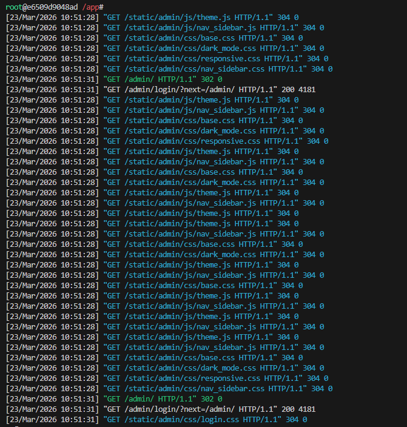

# ALUNO: ARTHUR DA SILVA MARIZ
# TADS 2026.1 - SISTEMAS OPERACIONAIS

## INTRODUÇÃO

A atividade feita em 23/03/2026 na disciplina de Sistemas Operacionais tem como objetivo criar uma aplicação Web com Django por meio do uso de Dockers.

## RELATO DAS ATIVIDADES
Para começar, tive de criar um Dockerfile e esse arquivo é tipo uma receita onde todos os conteiners criados a partir dela terão a mesma configuração.

Após isso, construi uma imagem chamada atividade-django-dev com esse dockerfile.

Por fim, criei um conteiner com essa imagem

Quando terminei de configurar o docker, comecei a mexer com a aplicação Django. Para isso, criei um projeto django pelo terminal, criei a aplicação e, como ela vem com o SQLite3 configurado como padrão, não tive de configurar o banco de dados.

Os próximos passos foram de adicionar a aplicação as configurações na lista INSTALLED_APPS, modificar ALLOWED_HOSTS para aceitar todos tipos de conexão e migrar o banco de dados e criar o superusuário.

Para finalizar essa seção, criei um view simples, página de apresentação, no script padrão para isso no django e configurei para URL padrão de entrada ser nessa view.

Agora no teste da aplicação, iniciei o servidor de teste com esse comando no terminal:

E acessei a porta onde está hospedada nossa aplicação Django para testar e apágina inicial é esta:

Esta é a página para entrar como admin:

E o painel de admin:

Assim que o servidor recebe as requisições:

## CONSIDERAÇÕES FINAIS
Com essa atividade, aprendi como cria uma aplicação Web e não imaginava que dava para fazer de forma tão simples. Existe alguns passos a passos até que extensos para realizar, mas parece uma etapa bem documentada. A importância do Docker ficou mais evidente também e me deu algumas ideias de como usá-lo para otimizar essa etapa inicial de configuração do Django. Não tive dificuldades na atividade, tudo estava documentado.